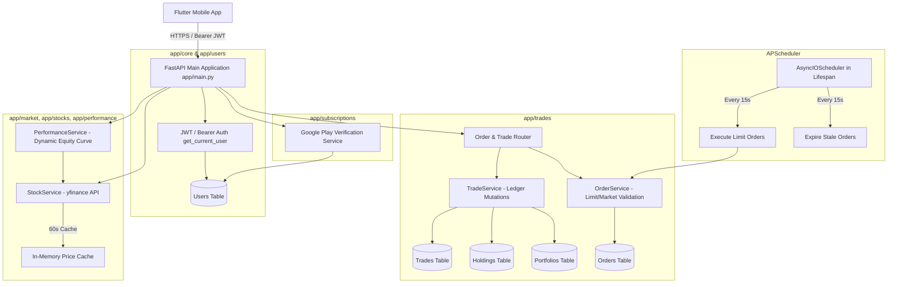
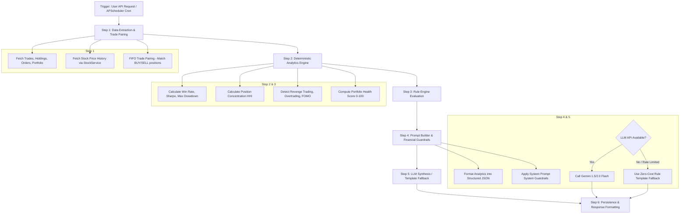
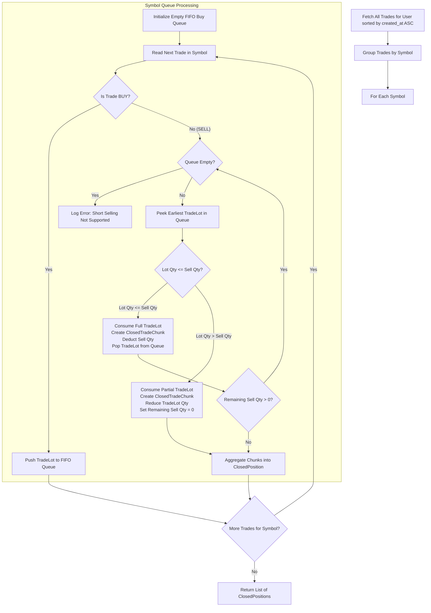
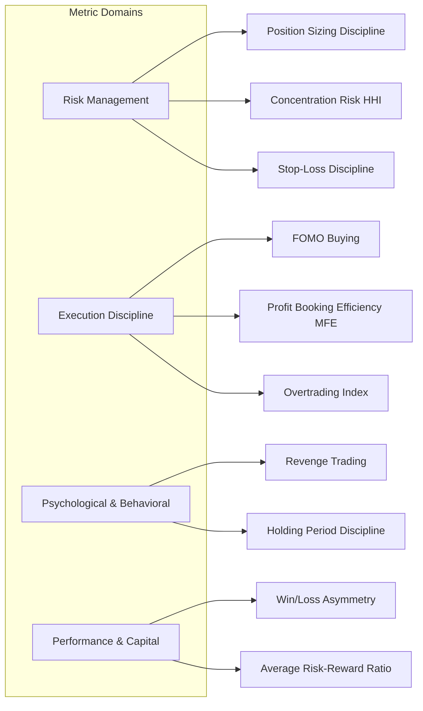
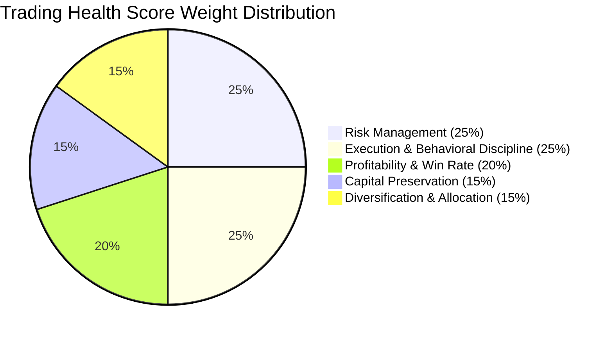
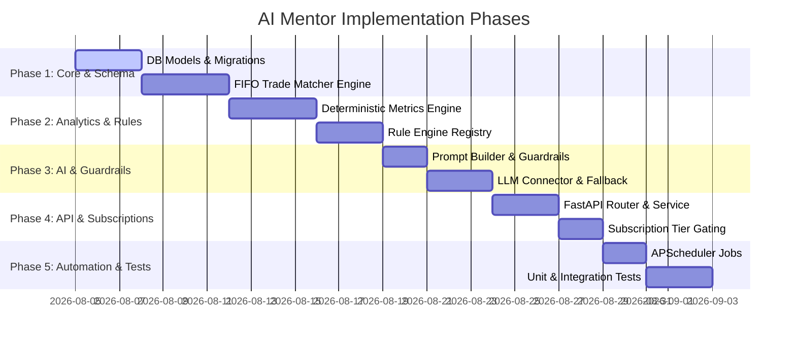

# AI Mentor Architecture & Implementation Blueprint
**PaperTrade Backend System**
*Document Version: 1.1.0*
*Author: Senior Software Architect*
*Target Repository: paperTradeBE*

---

## Executive Summary

The **AI Mentor** is a premium, high-value feature designed for the PaperTrade ecosystem to transform paper trading from a simple simulation into an intelligent, data-driven learning experience. It acts as an **educational trading coach**, analyzing user behavior, execution habits, portfolio risk, and historical performance to provide personalized feedback and natural-language guidance.

### Strict Architectural Boundaries & Constraints
1. **Zero Price Predictions**: The AI Mentor will **NEVER** predict stock prices, target prices, or market trends.
2. **Zero Buy/Sell Recommendations**: The system will **NEVER** advise buying, selling, or holding specific stocks.
3. **Mentor vs. Financial Advisor**: The tone and scope are strictly educational, focusing on trading discipline, risk management, trade execution habits, and statistical portfolio analysis.
4. **Deterministic Core**: All metrics, health scores, trade scores, mistake detections, and strength classifications are computed by deterministic business logic (Python analytics engine).
5. **AI as Natural Language Synthesizer**: LLMs (e.g. Gemini 1.5 Flash / 2.0 Flash) are used exclusively to synthesize structured deterministic data into encouraging, clear, human-like coaching advice.
6. **Cost & Performance Optimized**: Utilizes caching, pre-scheduled generation, structured JSON prompts, and template fallbacks to operate at negligible API cost (< $0.001 per review) with zero runtime latency for end users.

---

## Table of Contents

1. [Existing Architecture Overview](#1-existing-architecture-overview)
2. [Current Strengths & Weaknesses](#2-current-strengths--weaknesses)
3. [Required Database Changes](#3-required-database-changes)
4. [New Backend Modules (`app/mentor`)](#4-new-backend-modules-appmentor)
5. [Service Architecture & Pipeline](#5-service-architecture--pipeline)
6. [API Design Specification](#6-api-design-specification)
7. [Detailed Analytics Engine & FIFO Reconstruction](#7-detailed-analytics-engine--fifo-reconstruction)
8. [Behavioral Metrics Catalog & Trading Health Score](#8-behavioral-metrics-catalog--trading-health-score)
9. [Prompt Builder & Guardrails Design](#9-prompt-builder--guardrails-design)
10. [AI Integration Strategy](#10-ai-integration-strategy)
11. [Flutter Mobile Integration Plan](#11-flutter-mobile-integration-plan)
12. [Implementation Roadmap & Phases](#12-implementation-roadmap--phases)
13. [Risks, Mitigation & Architectural Recommendations](#13-risks-mitigation--architectural-recommendations)

---

## 1. Existing Architecture Overview

The `paperTradeBE` backend is built with **FastAPI** (Python 3.10+) following a domain-driven modular structure with **SQLAlchemy** (PostgreSQL / SQLite) for persistence and **APScheduler** for background job execution.

### Architectural Diagram of Existing System



### Domain Module Summary
- **`app/core`**: Configuration (`config.py`), JWT creation/validation, password hashing (`security.py`), and email handling (`email.py`).
- **`app/users`**: User registration, login, Google OAuth, password reset, and user profile management (`models.py`, `service.py`, `router.py`).
- **`app/trades`**: Core trading logic. Manages orders (Market & Limit), portfolio balances, holdings, realized/unrealized PnL, and IST market-hour validations.
- **`app/performance`**: Reconstructs historical equity curves over 1D, 5D, 1MO periods using trade history and cached `yfinance` historical price frames.
- **`app/stocks`**: Connects to `yfinance` for NSE live market data, stock list pagination, search, and in-memory TTL caching.
- **`app/subscriptions`**: Integrates with Google Play Android Publisher API (`v3`) to handle subscriptions (`FREE`, `PRO`, `PREMIUM`).
- **`app/chart`**: Provides candle data and stock chart visualizations.

---

## 2. Current Strengths & Weaknesses

### System Strengths
1. **Clean Domain Isolation**: Each feature (`users`, `trades`, `performance`, `stocks`, `subscriptions`) is neatly separated into `models`, `schema`, `service`, and `router`.
2. **Robust Order Execution**: Uses explicit PostgreSQL row-level locks (`with_for_update()`) and reservation management (cash for BUY limit orders, shares for SELL limit orders) to prevent double-spending or race conditions.
3. **Asynchronous Background Processing**: Integrated `APScheduler` inside FastAPI's lifespan manages pending orders efficiently.
4. **Subscription-Based Rate Limiting**: Built-in logic (`check_free_user_buy_cap`) enforces business rules (e.g. 5 buy orders/day for free users).

### System Weaknesses & Constraints for AI Mentor
1. **Dynamic Equity Curve Reconstruction**: `PerformanceService` dynamically calculates portfolio history on every API hit by stepping through all trades and fetching `yfinance` history. This can introduce latency for users with large trade histories.
2. **Synchronous Market Data Overhead**: `yfinance` calls can occasionally stall or hit rate limits if fetched repeatedly without fallback mechanisms.
3. **Lack of Trade Pairing Metadata**: The `Trade` model records raw transactions (`BUY`/`SELL` with symbol, quantity, price, timestamp), but does not explicitly link a `SELL` trade to its corresponding `BUY` trade(s). Trade-level analytics (holding time per completed position, trade PnL, win/loss per trade) must be calculated via FIFO reconstruction.
4. **No Persistent Daily Snapshots**: The DB does not currently save end-of-day portfolio balance snapshots.

---

## 3. Required Database Changes

To support the AI Mentor without polluting existing transaction tables, we introduce dedicated tables under the mentor domain and minimal non-breaking extensions.

### Entity Relationship Diagram (AI Mentor Extensions)

```mermaid
erDiagram
    users ||--o{ mentor_daily_reviews : receives
    users ||--o{ mentor_weekly_reports : receives
    users ||--o{ mentor_trade_scores : earns
    users ||--o{ mentor_habit_trackers : tracks
    users ||--o1 mentor_user_roadmaps : follows
    users ||--o1 mentor_user_settings : configures
    trades ||--o1 mentor_trade_scores : analyzed_in

    users {
        int id PK
        string email
        string subscription
    }

    mentor_daily_reviews {
        int id PK
        int user_id FK
        date review_date
        float health_score
        json metrics_summary
        json mistakes_identified
        json strengths_identified
        string ai_coaching_summary
        string action_item
        datetime created_at
    }

    mentor_weekly_reports {
        int id PK
        int user_id FK
        date week_start_date
        date week_end_date
        float health_score
        float win_rate
        float profit_factor
        int total_trades
        json category_scores
        string ai_weekly_narrative
        json weekly_goals
        datetime created_at
    }

    mentor_trade_scores {
        int id PK
        int trade_id FK
        int user_id FK
        float total_score
        float timing_score
        float sizing_score
        float risk_reward_score
        json detected_flaws
        json praise_points
        string ai_feedback
        datetime created_at
    }

    mentor_habit_trackers {
        int id PK
        int user_id FK
        string habit_key
        string habit_name
        int streak_count
        date last_completed_date
        json history_log
        datetime updated_at
    }

    mentor_user_roadmaps {
        int id PK
        int user_id FK
        string current_stage
        int current_level
        json completed_milestones
        json pending_milestones
        datetime updated_at
    }

    mentor_user_settings {
        int id PK
        int user_id FK
        boolean daily_review_enabled
        boolean weekly_report_enabled
        float max_risk_per_trade_pct
        datetime updated_at
    }
```

### Proposed SQLAlchemy Models (`app/mentor/models.py`)

```python
from datetime import datetime, date
from sqlalchemy import Column, Integer, String, Float, DateTime, Date, ForeignKey, JSON, Boolean, Text
from sqlalchemy.orm import Mapped, mapped_column, relationship
from app.database import Base

class MentorDailyReview(Base):
    __tablename__ = "mentor_daily_reviews"

    id: Mapped[int] = mapped_column(Integer, primary_key=True, index=True)
    user_id: Mapped[int] = mapped_column(Integer, ForeignKey("users.id", ondelete="CASCADE"), index=True)
    review_date: Mapped[date] = mapped_column(Date, index=True, default=date.today)
    
    health_score: Mapped[float] = mapped_column(Float, default=0.0)
    metrics_summary: Mapped[dict] = mapped_column(JSON, nullable=False)
    mistakes_identified: Mapped[list] = mapped_column(JSON, nullable=False)
    strengths_identified: Mapped[list] = mapped_column(JSON, nullable=False)
    
    ai_coaching_summary: Mapped[str] = mapped_column(Text, nullable=False)
    action_item: Mapped[str] = mapped_column(Text, nullable=False)
    
    created_at: Mapped[datetime] = mapped_column(DateTime, default=datetime.utcnow)

class MentorWeeklyReport(Base):
    __tablename__ = "mentor_weekly_reports"

    id: Mapped[int] = mapped_column(Integer, primary_key=True, index=True)
    user_id: Mapped[int] = mapped_column(Integer, ForeignKey("users.id", ondelete="CASCADE"), index=True)
    week_start_date: Mapped[date] = mapped_column(Date, nullable=False)
    week_end_date: Mapped[date] = mapped_column(Date, nullable=False, index=True)
    
    health_score: Mapped[float] = mapped_column(Float, default=0.0)
    win_rate: Mapped[float] = mapped_column(Float, default=0.0)
    profit_factor: Mapped[float] = mapped_column(Float, default=0.0)
    total_trades: Mapped[int] = mapped_column(Integer, default=0)
    
    category_scores: Mapped[dict] = mapped_column(JSON, nullable=False)
    ai_weekly_narrative: Mapped[str] = mapped_column(Text, nullable=False)
    weekly_goals: Mapped[list] = mapped_column(JSON, nullable=False)
    
    created_at: Mapped[datetime] = mapped_column(DateTime, default=datetime.utcnow)

class MentorTradeScore(Base):
    __tablename__ = "mentor_trade_scores"

    id: Mapped[int] = mapped_column(Integer, primary_key=True, index=True)
    trade_id: Mapped[int] = mapped_column(Integer, ForeignKey("trades.id", ondelete="CASCADE"), unique=True, index=True)
    user_id: Mapped[int] = mapped_column(Integer, ForeignKey("users.id", ondelete="CASCADE"), index=True)
    
    total_score: Mapped[float] = mapped_column(Float, nullable=False)
    timing_score: Mapped[float] = mapped_column(Float, default=0.0)
    sizing_score: Mapped[float] = mapped_column(Float, default=0.0)
    risk_reward_score: Mapped[float] = mapped_column(Float, default=0.0)
    
    detected_flaws: Mapped[list] = mapped_column(JSON, nullable=False)
    praise_points: Mapped[list] = mapped_column(JSON, nullable=False)
    ai_feedback: Mapped[str] = mapped_column(Text, nullable=False)
    
    created_at: Mapped[datetime] = mapped_column(DateTime, default=datetime.utcnow)

class MentorHabitTracker(Base):
    __tablename__ = "mentor_habit_trackers"

    id: Mapped[int] = mapped_column(Integer, primary_key=True, index=True)
    user_id: Mapped[int] = mapped_column(Integer, ForeignKey("users.id", ondelete="CASCADE"), index=True)
    habit_key: Mapped[str] = mapped_column(String, index=True)  # e.g., "STOP_LOSS_SET", "DAILY_REVIEW"
    habit_name: Mapped[str] = mapped_column(String, nullable=False)
    streak_count: Mapped[int] = mapped_column(Integer, default=0)
    last_completed_date: Mapped[date | None] = mapped_column(Date, nullable=True)
    history_log: Mapped[dict] = mapped_column(JSON, default=dict)
    updated_at: Mapped[datetime] = mapped_column(DateTime, default=datetime.utcnow, onupdate=datetime.utcnow)

class MentorUserRoadmap(Base):
    __tablename__ = "mentor_user_roadmaps"

    id: Mapped[int] = mapped_column(Integer, primary_key=True, index=True)
    user_id: Mapped[int] = mapped_column(Integer, ForeignKey("users.id", ondelete="CASCADE"), unique=True, index=True)
    current_stage: Mapped[str] = mapped_column(String, default="NOVICE") # NOVICE, APPRENTICE, DISCIPLINED, PRO
    current_level: Mapped[int] = mapped_column(Integer, default=1)
    completed_milestones: Mapped[list] = mapped_column(JSON, default=list)
    pending_milestones: Mapped[list] = mapped_column(JSON, default=list)
    updated_at: Mapped[datetime] = mapped_column(DateTime, default=datetime.utcnow, onupdate=datetime.utcnow)
```

---

## 4. New Backend Modules (`app/mentor`)

To maintain current project style, we place all AI Mentor logic under `app/mentor`:

```
app/mentor/
├── __init__.py
├── models.py           # SQLAlchemy database tables
├── schema.py           # Pydantic request/response schemas
├── analytics.py        # Deterministic mathematical engine (scores, statistics, FIFO reconstruction)
├── rule_engine.py      # Rule registry for mistake, strength & habit detection
├── prompt_builder.py   # Guardrailed LLM prompt context generators
├── llm_service.py      # Async LLM connector (Gemini/OpenAI) + Fallback engine
├── service.py          # Workflow orchestrator & business service
├── router.py           # FastAPI endpoints & subscription gating
└── scheduler.py        # APScheduler jobs for background daily/weekly generation
```

---

## 5. Service Architecture & Pipeline

The AI Mentor operates on a strict **6-Step Pipeline**:



---

## 6. API Design Specification

All endpoints require standard `Bearer JWT` authentication and enforce subscription tier restrictions (`PRO` or `PREMIUM`).

| Method | Endpoint | Access Tier | Description |
| :--- | :--- | :--- | :--- |
| `GET` | `/mentor/dashboard` | PRO / PREMIUM | Returns quick snapshot: health score, latest daily summary, habit streaks, top strengths/mistakes. |
| `GET` | `/mentor/daily-review` | PRO / PREMIUM | Fetches or generates today's portfolio review & daily coaching. |
| `POST`| `/mentor/daily-review/generate` | PRO / PREMIUM | Force re-generates daily review (rate limited to 3/day). |
| `GET` | `/mentor/weekly-report` | PRO / PREMIUM | Fetches current week's comprehensive performance report & narrative. |
| `GET` | `/mentor/trade-score/{trade_id}` | PRO / PREMIUM | Evaluates execution quality for a single completed trade. |
| `GET` | `/mentor/portfolio-health` | PRO / PREMIUM | Returns granular sub-score breakdown (Risk, Sizing, Diversification, Discipline). |
| `GET` | `/mentor/habits` | PRO / PREMIUM | Retrieves active trading habits and current streaks. |
| `POST`| `/mentor/habits/check-in` | PRO / PREMIUM | Logs habit completion (e.g. reviewed trade plan before market open). |
| `GET` | `/mentor/roadmap` | PRO / PREMIUM | Retrieves user's personalized learning roadmap and milestones. |

---

## 7. Detailed Analytics Engine & FIFO Reconstruction

The **Analytics Engine** (`app/mentor/analytics.py`) converts unstructured, discrete `Trade` table records into paired **Closed Positions** and quantitative behavioral indicators.

### 7.1 Deep-Dive: FIFO Trade Reconstruction Algorithm

In the `trades` database table, transactions are stored as standalone execution rows (`id`, `user_id`, `symbol`, `quantity`, `price`, `trade_type`, `created_at`). There is no native pairing between BUYs and SELLs.

To compute trade-level analytics (holding period, win/loss, realized PnL per position, entry timing), we use a **FIFO (First-In, First-Out) Position Matching Algorithm**.

#### Algorithm Data Structures

```python
from dataclasses import dataclass, field
from datetime import datetime
from typing import List, Dict, Optional

@dataclass
class TradeLot:
    trade_id: int
    price: float
    remaining_quantity: int
    timestamp: datetime

@dataclass
class ClosedTradeChunk:
    buy_trade_id: int
    sell_trade_id: int
    buy_price: float
    sell_price: float
    matched_quantity: int
    buy_timestamp: datetime
    sell_timestamp: datetime
    pnl: float
    pnl_percent: float
    holding_duration_minutes: float

@dataclass
class ClosedPosition:
    position_id: str
    symbol: str
    total_quantity: int
    weighted_avg_buy_price: float
    weighted_avg_sell_price: float
    realized_pnl: float
    realized_pnl_percent: float
    open_timestamp: datetime
    close_timestamp: datetime
    holding_duration_minutes: float
    chunks: List[ClosedTradeChunk] = field(default_factory=list)
```

#### Step-by-Step FIFO Matching Process



#### Handling Partial & Scaled Orders (Edge Cases)

1. **Partial Sell against Single Large Buy**:
   - A user buys 100 shares of RELIANCE at ₹2,500. Later, sells 40 shares at ₹2,600.
   - *Result*: Creates a `ClosedTradeChunk` for 40 shares with PnL = $+₹4,000$. The remaining 60 shares stay in the `TradeLot` queue with original timestamp and ₹2,500 cost basis.
2. **Single Sell Consuming Multiple Partial Scale-In Buys**:
   - Buy 50 shares at ₹100 (t1), Buy 50 shares at ₹110 (t2). Sell 100 shares at ₹120 (t3).
   - *Result*: The algorithm matches 50 shares against lot t1 ($PnL = +₹1,000$) and 50 shares against lot t2 ($PnL = +₹500$). These two chunks combine into one `ClosedPosition` with:
     $$\text{Weighted Avg Buy Price} = \frac{(50 \times 100) + (50 \times 110)}{100} = ₹105.00$$
     $$\text{Realized PnL} = (120 - 105) \times 100 = +₹1,500$$
     $$\text{Open Timestamp} = t1, \quad \text{Close Timestamp} = t3$$

---

## 8. Behavioral Metrics Catalog & Trading Health Score

The system converts raw `ClosedPositions`, `Order` logs, and market price streams into **10 Core Behavioral Metrics**.

### 8.1 Detailed Behavioral Metrics Specification



---

### Detailed Specification for Every Metric

#### 1. Revenge Trading
- **Description**: Impulse trades executed rapidly following a losing trade to "make back" money, usually characterized by increased position size or emotional symbol selection.
- **Mathematical Formula**:
  $$R_{\text{revenge}} = \frac{N_{\text{revenge\_trades}}}{N_{\text{losing\_trades}}}$$
  Where a trade $T_k$ is classified as a *Revenge Trade* if:
  $$\text{Timestamp}(T_k) - \text{Timestamp}(\text{Close}(T_{\text{loss}})) \le 15 \text{ minutes} \quad \text{AND} \quad \text{Qty}(T_k) \ge 0.8 \times \text{Qty}(T_{\text{loss}})$$
- **Threshold**:
  - `OK`: $R_{\text{revenge}} = 0\%$
  - `LOW`: $0\% < R_{\text{revenge}} \le 10\%$
  - `MEDIUM`: $10\% < R_{\text{revenge}} \le 25\%$
  - `HIGH / CRITICAL`: $R_{\text{revenge}} > 25\%$
- **Severity**: `CRITICAL`
- **Coaching Message**: *"You executed a new trade within 15 minutes of closing a losing position. Take a mandatory 15-minute breather after any loss to reset your emotional state."*

---

#### 2. FOMO Buying (Chasing Momentum)
- **Description**: Purchasing stocks near intraday price peaks during high volatility instead of buying near key support levels.
- **Mathematical Formula**:
  $$\text{Intraday Position Index (IPI)} = \frac{P_{\text{buy}} - P_{\text{day\_low}}}{P_{\text{day\_high}} - P_{\text{day\_low}}}$$
  A buy trade is flagged as FOMO if $\text{IPI} \ge 0.85$ (entered in top 15% of the day's price range).
- **Threshold**:
  - `OK`: $\le 10\%$ of buy trades flagged as FOMO
  - `MEDIUM`: $10\% < \text{FOMO \%} \le 30\%$
  - `HIGH`: $> 30\%$ of buy trades flagged as FOMO
- **Severity**: `HIGH`
- **Coaching Message**: *"Over 30% of your buy entries were near intraday high prices. Avoid chasing momentum spikes; wait for healthy pullbacks to support levels."*

---

#### 3. Position Sizing Discipline
- **Description**: Adherence to maximum risk exposure caps per individual stock position relative to total portfolio capital.
- **Mathematical Formula**:
  $$\text{Allocation } \% = \frac{\text{Quantity} \times \text{Entry Price}}{\text{Total Portfolio Value}} \times 100$$
  $$\text{Sizing Variance} = \max(0, \text{Allocation } \% - \text{Target Max } \%) \quad (\text{Target Max} = 10\%)$$
- **Threshold**:
  - `OK`: Max position $\le 10\%$ of portfolio
  - `MEDIUM`: $10\% < \text{Max Position} \le 20\%$
  - `CRITICAL`: Max Position $> 20\%$ of portfolio
- **Severity**: `CRITICAL`
- **Coaching Message**: *"Position size in RELIANCE reached 24% of your total portfolio. Limit maximum single-stock exposure to 10% to prevent severe drawdown risks."*

---

#### 4. Holding Period Discipline (Win/Loss Duration Asymmetry)
- **Description**: Comparing average holding duration of losing trades versus winning trades ("cutting losses quick vs holding losers").
- **Mathematical Formula**:
  $$H_{\text{ratio}} = \frac{\text{Mean Duration}(\text{Losing Positions})}{\text{Mean Duration}(\text{Winning Positions})}$$
- **Threshold**:
  - `EXCELLENT`: $H_{\text{ratio}} \le 0.8$ (cut losses faster than wins)
  - `ACCEPTABLE`: $0.8 < H_{\text{ratio}} \le 1.5$
  - `HIGH`: $1.5 < H_{\text{ratio}} \le 3.0$
  - `CRITICAL`: $H_{\text{ratio}} > 3.0$ (holding losing trades 3x longer than winners)
- **Severity**: `HIGH`
- **Coaching Message**: *"You hold losing positions 3.2x longer than winning positions. Cultivate discipline by cutting losses early and letting winning trades reach targets."*

---

#### 5. Concentration Risk (Herfindahl-Hirschman Index - HHI)
- **Description**: Measuring portfolio capital diversification across holdings.
- **Mathematical Formula**:
  $$\text{HHI} = \sum_{i=1}^{N} \left( \frac{\text{Holding Value}_i}{\text{Total Invested Value}} \times 100 \right)^2$$
- **Threshold**:
  - `WELL_DIVERSIFIED`: $\text{HHI} < 1,800$ (equivalent to $\ge 6$ equal positions)
  - `MODERATE_CONCENTRATION`: $1,800 \le \text{HHI} \le 3,000$
  - `HIGH_CONCENTRATION`: $\text{HHI} > 3,000$ (top holdings dominate portfolio)
- **Severity**: `MEDIUM`
- **Coaching Message**: *"Portfolio concentration is high (HHI = 3,450). Consider spreading capital across 4 to 6 non-correlated stocks or sectors."*

---

#### 6. Stop-Loss Discipline
- **Description**: Tracking whether trades are exited before suffering unmanaged capital drawdowns ($> -5\%$).
- **Mathematical Formula**:
  $$\text{Unmanaged Loss Rate} = \frac{N_{\text{trades with PnL} < -5.0\%}}{N_{\text{total closed losing trades}}}$$
- **Threshold**:
  - `EXCELLENT`: Unmanaged Loss Rate $= 0\%$
  - `MEDIUM`: $0\% < \text{Rate} \le 15\%$
  - `CRITICAL`: $\text{Rate} > 15\%$
- **Severity**: `CRITICAL`
- **Coaching Message**: *"18% of your losing trades suffered losses exceeding -5%. Define a strict mental or order-based stop-loss before entering every trade."*

---

#### 7. Profit Booking Discipline (MFE Efficiency)
- **Description**: Evaluating how much maximum favorable unrealized gain was captured before exiting a winning position.
- **Mathematical Formula**:
  $$\text{Profit Capture Efficiency} = \frac{\text{Realized PnL}}{\text{Maximum Favorable Excursion (MFE PnL)}}$$
  *(Where MFE is peak unrealized PnL reached during the trade lifetime).*
- **Threshold**:
  - `EXCELLENT`: Efficiency $\ge 70\%$
  - `GOOD`: $50\% \le \text{Efficiency} < 70\%$
  - `POOR`: Efficiency $< 50\%$ (giving back $> 50\%$ of peak gains before exit)
- **Severity**: `LOW`
- **Coaching Message**: *"You gave back over 55% of open profits in TATAMOTORS before closing. Implement trailing stop-losses to lock in gains."*

---

#### 8. Overtrading Index
- **Description**: Comparing daily trade frequency against the trader's 30-day baseline average.
- **Mathematical Formula**:
  $$\text{Overtrade Factor} = \frac{\text{Trades Executed Today}}{\text{Rolling 30-Day Mean Daily Trades}}$$
- **Threshold**:
  - `NORMAL`: Factor $\le 1.5$
  - `ELEVATED`: $1.5 < \text{Factor} \le 2.5$
  - `HIGH / OVERTRADING`: Factor $> 2.5$ (or $> 12$ trades/day for swing accounts)
- **Severity**: `MEDIUM`
- **Coaching Message**: *"You executed 14 trades today (2.8x your average). Excessive trading increases decision fatigue and commission drag."*

---

#### 9. Average Risk-Reward Ratio (RRR)
- **Description**: Ratio of average monetary gain on winning trades to average monetary loss on losing trades.
- **Mathematical Formula**:
  $$\text{RRR} = \frac{\text{Mean PnL of Winning Trades}}{|\text{Mean PnL of Losing Trades}|}$$
- **Threshold**:
  - `EXCELLENT`: $\text{RRR} \ge 2.0$
  - `GOOD`: $1.5 \le \text{RRR} < 2.0$
  - `SUBOPTIMAL`: $1.0 \le \text{RRR} < 1.5$
  - `POOR`: $\text{RRR} < 1.0$ (average loss is larger than average win)
- **Severity**: `HIGH`
- **Coaching Message**: *"Your average win (₹850) is smaller than your average loss (₹1,200), resulting in an RRR of 0.71. Target at least a 1.5:1 reward-to-risk ratio."*

---

#### 10. Capital Preservation (Max Equity Drawdown)
- **Description**: Peak-to-trough decline of overall portfolio net worth.
- **Mathematical Formula**:
  $$\text{Max Drawdown \%} = \frac{\text{Peak Net Worth} - \text{Current Net Worth}}{\text{Peak Net Worth}} \times 100$$
- **Threshold**:
  - `LOW_RISK`: Drawdown $\le 5\%$
  - `MODERATE`: $5\% < \text{Drawdown} \le 12\%$
  - `HIGH`: $12\% < \text{Drawdown} \le 20\%$
  - `CRITICAL`: Drawdown $> 20\%$
- **Severity**: `CRITICAL`
- **Coaching Message**: *"Portfolio drawdown has reached 14.5% from peak equity. Scale back position sizes by 50% until performance stabilizes."*

---

### 8.2 Comprehensive Trading Health Score System (0 - 100 Scale)

The **Trading Health Score** is calculated using a **Weighted Sub-Score Category Architecture** with explicit penalty deductions.



#### Category Weight & Sub-Score Formulas

$$\text{Health Score} = 0.25 \cdot S_{\text{Risk}} + 0.25 \cdot S_{\text{Discipline}} + 0.20 \cdot S_{\text{Profitability}} + 0.15 \cdot S_{\text{Preservation}} + 0.15 \cdot S_{\text{Diversification}} - \text{Penalties}$$

1. **$S_{\text{Risk}}$ (Risk Management Sub-Score - 25% Weight)**:
   - Starts at 100 points.
   - Deduct 30 points if Stop-Loss Unmanaged Rate $> 15\%$.
   - Deduct 25 points if Position Sizing $> 15\%$ of portfolio.
   - Deduct 20 points if Average RRR $< 1.0$.

2. **$S_{\text{Discipline}}$ (Execution & Behavioral Discipline - 25% Weight)**:
   - Starts at 100 points.
   - Deduct 35 points if Revenge Trading Rate $> 10\%$.
   - Deduct 25 points if FOMO Buying Rate $> 25\%$.
   - Deduct 20 points if Overtrading Factor $> 2.0$.
   - Deduct 20 points if Holding Asymmetry Ratio $> 2.5$.

3. **$S_{\text{Profitability}}$ (Profitability & Win Rate - 20% Weight)**:
   - Evaluated as:
     $$S_{\text{Profitability}} = \min\left(100, (\text{Win Rate \%} \times 0.6) + (\min(\text{Profit Factor}, 3.0) \times 13.3)\right)$$

4. **$S_{\text{Preservation}}$ (Capital Preservation - 15% Weight)**:
   - Evaluated from Max Drawdown ($DD\%$):
     $$S_{\text{Preservation}} = \max\left(0, 100 - (DD\% \times 4.0)\right)$$

5. **$S_{\text{Diversification}}$ (Diversification & Asset Allocation - 15% Weight)**:
   - Evaluated from HHI Index:
     $$S_{\text{Diversification}} = \max\left(0, 100 - \max(0, \text{HHI} - 1000) \times 0.03\right)$$

#### Critical Penalty Deductions
If a user triggers any **CRITICAL** severity flaw in the last 24 hours, an absolute penalty is subtracted directly from the total computed Health Score:
- **Revenge Trading Active Today**: $-15$ points penalty.
- **Single Position Oversized $> 25\%$**: $-10$ points penalty.
- **Drawdown Exceeds $> 20\%$**: $-15$ points penalty.

#### Health Score Grading Scale
- **90 - 100**: `MASTER` (Disciplined execution, optimal risk control)
- **75 - 89**: `DISCIPLINED` (Strong performance, minor execution tweaks needed)
- **60 - 74**: `AVERAGE` (Consistent profitability with moderate emotional leaks)
- **40 - 59**: `NEEDS_WORK` (Frequent sizing or discipline mistakes)
- **0 - 39**: `HIGH_RISK` (Severe capital risk, immediate coaching required)

---

## 9. Prompt Builder & Guardrails Design

The **Prompt Builder** (`app/mentor/prompt_builder.py`) converts deterministic analytics results into a clean, structured JSON context for the LLM. It guarantees strict financial boundary adherence.

### System Prompt (Strict Guardrails & Persona)

```text
YOU ARE AN ELITE TRADING MENTOR & BEHAVHAVIORAL COACH FOR PAPERTRADE.

CRITICAL FINANCIAL & LEGAL GUARDRAILS:
1. NEVER PREDICT FUTURE STOCK PRICES OR MARKET MOVEMENTS.
2. NEVER RECOMMEND BUYING, SELLING, OR HOLDING ANY SPECIFIC STOCK.
3. NEVER GIVE FINANCIAL OR INVESTMENT ADVICE.
4. DO NOT SAY "You should buy X" OR "Sell Y now".
5. FOCUS EXCLUSIVELY ON TRADING DISCIPLINE, RISK MANAGEMENT, BEHAVIORAL PATTERNS, POSITION SIZING, AND STATISTICAL PERFORMANCE.
6. ADAPT A CONSTRUCTIVE, ENCOURAGING, PROFESSIONAL COACHING TONE.

INPUT DATA PROVIDED TO YOU IS 100% DETERMINISTIC AND FACTUAL.
SYNTHESIZE THE INJECTED METRICS AND TRIGGERED RULES INTO A CONCISE, HIGH-VALUE MENTOR SUMMARY.
```

### Context Injection Structure (JSON payload to LLM)

```json
{
  "user_profile": {
    "experience_level": "Apprentice",
    "subscription": "PRO"
  },
  "period_analytics": {
    "win_rate_pct": 60.0,
    "profit_factor": 1.85,
    "total_trades": 8,
    "health_score": 78.5,
    "net_worth": 104250.0,
    "realized_pnl": 4250.0,
    "holding_duration_ratio": 1.2,
    "rrr": 1.65,
    "hhi_index": 2100
  },
  "triggered_rules": [
    {
      "rule_id": "STRENGTH_CUT_LOSS_EARLY",
      "category": "STRENGTH",
      "severity": "LOW",
      "metrics_context": { "avg_loss": 450, "avg_win": 1200 }
    },
    {
      "rule_id": "MISTAKE_REVENGE_TRADING",
      "category": "MISTAKE",
      "severity": "CRITICAL",
      "metrics_context": { "time_gap_minutes": 6, "loss_amount": 800 }
    }
  ]
}
```

---

## 10. AI Integration Strategy

### Multi-Provider Strategy (Gemini 1.5/2.0 Flash Primary)
- **Primary LLM**: Google Gemini 1.5 Flash / Gemini 2.0 Flash via standard Google GenAI SDK / HTTP. Fast response time (~400ms) and low cost ($0.075 / 1M input tokens).
- **Secondary Fallback LLM**: OpenAI `gpt-4o-mini` or Anthropic `claude-3-5-haiku`.

### Zero-Cost Fallback Engine (Template Generator)
If LLM APIs experience downtime, network timeouts, or rate limits, `llm_service.py` dynamically falls back to a **Deterministic String Template Synthesizer**. The user receives instant feedback without seeing API errors!

```python
class LLMService:
    async def generate_coaching(self, analytics_data: dict, rules: list) -> str:
        try:
            return await self._call_gemini_api(analytics_data, rules)
        except Exception as e:
            logger.warning("LLM API unavailable, reverting to deterministic template: %s", e)
            return self._generate_template_fallback(analytics_data, rules)

    def _generate_template_fallback(self, analytics: dict, rules: list) -> str:
        strengths = [r['title'] for r in rules if r['category'] == 'STRENGTH']
        mistakes = [r['title'] for r in rules if r['category'] == 'MISTAKE']
        
        summary = f"Your portfolio health score is {analytics['health_score']}/100. "
        if strengths:
            summary += f"Key strength observed: {strengths[0]}. "
        if mistakes:
            summary += f"Area for improvement: {mistakes[0]}."
        return summary
```

### Cost Minimization Strategy
1. **Pre-Scheduled Generation**: Daily reviews for active users are pre-generated during market close (15:30 IST) via APScheduler.
2. **Database Caching**: Reviews are stored in `mentor_daily_reviews` and `mentor_weekly_reports`. Subsequent GET requests read directly from PostgreSQL without hitting LLM endpoints.
3. **Max Tokens Cap**: Output response cap set strictly to 250 tokens per review.

---

## 11. Flutter Mobile Integration Plan

### UI Component Integration (Flutter Frontend)
1. **Mentor Dashboard Widget**: Displays overall Portfolio Health Gauge (0-100 dial), daily coaching summary card, and active habit streak counter.
2. **Trade Analysis Sheet**: Modal bottom sheet popping up after completing a trade, rendering the `MentorTradeScore` radar/bar chart and feedback.
3. **Weekly Coach Tab**: Dedicated screen featuring weekly performance trends, mistake frequency charts, and progress along the Learning Roadmap.

### State Management & Architecture (Flutter)
- **Pattern**: Clean Architecture (Data -> Repository -> BLoC/Riverpod -> UI).
- **Caching**: Offline caching using `Hive` or `shared_preferences` so reviews load instantly offline.

---

## 12. Implementation Roadmap & Phases



### Phase Details

#### Phase 1: Database & Core Trade Pairing (Est. 7 Days)
- Create Alembic migration script for `mentor_*` tables.
- Implement FIFO trade position reconstruction in `app/mentor/analytics.py`.

#### Phase 2: Analytics & Rule Engine (Est. 7 Days)
- Implement mathematical formulas for Portfolio Health Score, Trade Score, and Risk Metrics.
- Build the Rule Engine catalog for mistake detection, strengths, and habits.

#### Phase 3: AI Integration & Fallback (Est. 5 Days)
- Create `PromptBuilder` with strict guardrails against price prediction and financial advice.
- Build `LLMService` integrating Gemini API + zero-cost string template fallback.

#### Phase 4: API Endpoints & Subscription Gating (Est. 5 Days)
- Build FastAPI routes in `app/mentor/router.py`.
- Integrate subscription checks (`User.subscription in [PRO, PREMIUM]`).

#### Phase 5: Async Background Jobs & Testing (Est. 5 Days)
- Add daily & weekly batch generation jobs to `app/trades/scheduler.py`.
- Write comprehensive unit tests for rule detection and analytics calculation.

---

## 13. Risks, Mitigation & Architectural Recommendations

| Identified Risk | Severity | Mitigation Strategy |
| :--- | :--- | :--- |
| **Legal / Compliance Risk** (Accidental financial advice or price prediction) | **CRITICAL** | Strict System Prompt constraints + post-processing regex guardrail filter that strips any price targets or buy/sell wording before returning to client. |
| **LLM Rate Limiting / Latency** | **MEDIUM** | Asynchronous generation via APScheduler + cached responses in DB + deterministic zero-cost template fallback. |
| **yfinance Dependency Latency** | **MEDIUM** | Leverage existing `get_cached_historical_prices` in `app/stocks/service.py` (10-min TTL) to prevent duplicate external calls. |
| **API Operating Costs** | **LOW** | Low token prompts (~300 tokens input, ~150 tokens output) with Gemini Flash yields costs under **$0.0005 per user review**. |

---

### Architect's Recommendation
1. **Approve Architecture Document**: Proceed with creating `app/mentor` structure once explicitly confirmed by user.
2. **Prioritize Deterministic Engine**: Ensure 100% test coverage on `analytics.py` and `rule_engine.py` using standard `pytest` test suites.
3. **Decoupled LLM Provider**: Interface `LLMService` abstractly so switching from Gemini to Claude/OpenAI or local LLM models requires zero code changes to business logic.
