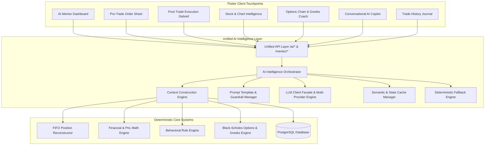
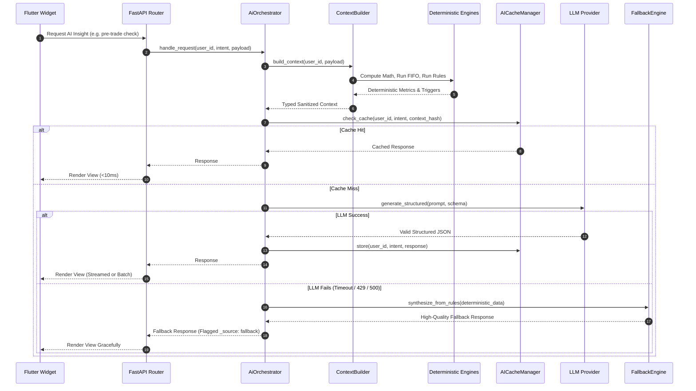
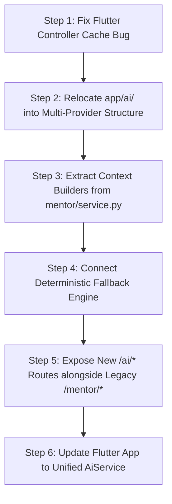

# Paper Trade Unified AI Architecture Design Specification

**Document Title:** Paper Trade Unified AI Intelligence Architecture  
**Target Artifact:** `PAPER_TRADE_AI_ARCHITECTURE.md`  
**Version:** 1.0.0  
**Status:** Approved Technical Architecture Specification  
**Systems:** FastAPI Backend (`paperTradeBE`), Flutter Mobile Client (`paper_trade`)  
**Scope:** Universal AI Infrastructure for Equity, Options, Real-Time Coaching, and Conversational Assistance  

---

## Executive Summary

This specification establishes the architectural blueprint for evolving Paper Trade's AI capabilities from a single, isolated **AI Mentor** screen into an **omnipresent, unified intelligence layer**.

### The Core Architectural Tenet
> **AI is a platform-wide capability, not an ad-hoc implementation per screen.**

Instead of scattering custom prompt strings, disparate HTTP calls, and redundant parsing logic across frontend views and backend routers, all AI features in Paper Trade will leverage a single, shared **AI Intelligence Foundation**.



---

## Table of Contents

1. [Current AI Architecture Audit](#1-current-ai-architecture-audit)
2. [Problems & Structural Deficiencies of Current System](#2-problems--structural-deficiencies-of-current-system)
3. [Proposed Unified AI Architecture](#3-proposed-unified-ai-architecture)
4. [Strict Boundary Separation: Deterministic vs. Generative](#4-strict-boundary-separation-deterministic-vs-generative)
5. [End-to-End Data & Context Flow](#5-end-to-end-data--context-flow)
6. [Backend Module Structure & Class Design](#6-backend-module-structure--class-design)
7. [The 8 Platform AI Capabilities (Detailed Specifications)](#7-the-8-platform-ai-capabilities-detailed-specifications)
   - [7.1 Existing AI Mentor (Evolution)](#71-existing-ai-mentor-evolution)
   - [7.2 Stock & Market Intelligence](#72-stock--market-intelligence)
   - [7.3 Pre-Trade Coaching & Risk Interception](#73-pre-trade-coaching--risk-interception)
   - [7.4 Post-Trade Execution Debrief](#74-post-trade-execution-debrief)
   - [7.5 Portfolio Deep Analysis](#75-portfolio-deep-analysis)
   - [7.6 Trading History & Intelligent Journal](#76-trading-history--intelligent-journal)
   - [7.7 Conversational AI Assistant (Copilot)](#77-conversational-ai-assistant-copilot)
   - [7.8 Future Options Intelligence](#78-future-options-intelligence)
8. [API Surface Specification](#8-api-surface-specification)
9. [Flutter Integration Architecture](#9-flutter-integration-architecture)
10. [LLM Client, Provider Abstraction & Streaming](#10-llm-client-provider-abstraction--streaming)
11. [Prompt Management, Structured Output & Validation](#11-prompt-management-structured-output--validation)
12. [Resilience, Error Handling & Deterministic Fallback](#12-resilience-error-handling--deterministic-fallback)
13. [Token Economics, Cost Optimization & Caching](#13-token-economics-cost-optimization--caching)
14. [Rate Limiting, Safety & Privacy Boundaries](#14-rate-limiting-safety--privacy-boundaries)
15. [Migration Plan from Current Mentor Codebase](#15-migration-plan-from-current-mentor-codebase)
16. [Phase-by-Phase Implementation Plan](#16-phase-by-phase-implementation-plan)
17. [Definition of Done](#17-definition-of-done)

---

## 1. Current AI Architecture Audit

The existing AI implementation in `paperTradeBE` is organized across two distinct packages:
1. `app/ai`: Provider abstraction wrapping the OpenAI SDK pointing to OpenRouter.
2. `app/mentor`: Deterministic analytics, rule evaluation, and review persistence.

### Existing Backend Layout
```
paperTradeBE/app/
├── ai/
│   ├── providers/
│   │   ├── base.py         # Abstract BaseAIProvider (generate, generate_async)
│   │   └── openrouter.py   # OpenRouterProvider (AsyncOpenAI via openrouter.ai)
│   ├── client.py       # AIClient facade
│   ├── exceptions.py   # Custom AI exception hierarchy
│   └── settings.py     # AISettings (OPENROUTER_MODEL, timeout, API key)
└── mentor/
    ├── analytics.py    # AnalyticsEngine (23 deterministic mathematical metrics)
    ├── fifo.py         # FIFOReconstructor (matches chronological BUYs/SELLs)
    ├── models.py       # MentorReview SQLAlchemy table
    ├── prioritizer.py  # Health score calculator (0-100) & insight ranker
    ├── rule_engine.py  # RuleEngine (9 behavioral mistake/strength rules)
    ├── schema.py       # Pydantic data contracts (MentorResponse, DailyMentorReview)
    ├── service.py      # MentorService orchestrator
    └── router.py       # FastAPI endpoints (/mentor/daily-review, etc.)
```

### Current End-to-End Trace
1. **Trigger**: Flutter user opens AI Mentor screen (`MentorView`).
2. **Client Call**: `MentorController.loadReview()` executes `repository.regenerateDailyReview()`.
3. **API Route**: Hits `POST /mentor/regenerate` with user Bearer JWT.
4. **Data Assembly**: `MentorService` reads all user trades from PostgreSQL `trades` table.
5. **Reconstruction**: `FIFOReconstructor` pairs execution records into closed position campaigns.
6. **Metrics**: `AnalyticsEngine` computes win rate, profit factor, drawdown, duration ratio, etc.
7. **Rules**: `RuleEngine` evaluates behavioral patterns (revenge trading, overtrading, sizing).
8. **Scoring**: `InsightPrioritizer` computes Trading Health Score (0–100) and 5 sub-scores.
9. **Context Extraction**: `_build_mentor_context()` isolates 11 neutral metrics into `MentorContext`.
10. **Sanitization**: `_validate_llm_context()` strictly asserts that no rule labels or stock symbols leak.
11. **LLM Execution**: Sends system prompt + JSON metrics string to OpenRouter (`deepseek/deepseek-chat-v3`).
12. **Persistence**: Validates JSON response with Pydantic and stores row in `mentor_reviews`.
13. **Presentation**: Client displays circular health score ring, coaching cards, and category sliders.

---

## 2. Problems & Structural Deficiencies of Current System

| Issue Area | Existing Codebase Defect | Business & Technical Impact |
| :--- | :--- | :--- |
| **Siloed Implementation** | AI logic lives entirely inside `app/mentor/`. There is zero mechanism to query AI from the order placement sheet, stock chart, or history list. | Features cannot reuse prompt logic, context builders, or token budgets; leads to copy-paste code. |
| **Client Redundancy Bug** | [`mentor_controller.dart:29`](file:///Users/sawankumar/Desktop/Projects/pt/paper_trade/lib/app/modules/mentor/controllers/mentor_controller.dart#L29) calls `repository.regenerateDailyReview()` instead of `getDailyReview()`. | Bypasses the database cache on every view load; forces a 2–4s LLM execution and wastes API credits. |
| **Orphaned Endpoints** | `GET /mentor/trade-review/{trade_id}` discards `trade_id` and summarizes the entire portfolio. Never called by Flutter. | Dead endpoint; single-trade debrief feature is non-functional. |
| **Fragile Provider Coupling** | Single provider (`OpenRouterProvider`). If OpenRouter rate-limits (429) or fails (500), API raises HTTP 502/503. | User experiences an error screen rather than receiving deterministic guidance. |
| **Lack of Streaming** | All calls use blocking request-response HTTP cycles. | User stares at a loading spinner for 3–5 seconds; unacceptable for conversational chat or order-sheet warnings. |
| **No Conversation State** | No session management, message memory, or chat persistence. | Conversational AI assistant cannot be built on the current foundation. |

---

## 3. Proposed Unified AI Architecture

The proposed architecture organizes AI into four decoupled layers following SOLID principles:

```mermaid
graph TD
    subgraph Presentation Layer [Flutter Client]
        WIDGETS[AI Widgets: Banners, Sheets, Cards, Chat Drawer]
        CLIENT_REPO[AiRepository & MentorRepository]
    end

    subgraph Orchestration & Routing Layer [FastAPI app/ai/]
        ROUTERS[FastAPI Routers: /ai/coach, /ai/pre-trade, /ai/chat, etc.]
        ORCHESTRATOR[AiOrchestratorService]
    end

    subgraph Intelligence Engine [app/ai/engine/]
        CTX_REGISTRY[Context Builder Registry]
        PROMPT_REGISTRY[Prompt Template Registry]
        VALIDATOR[Pydantic Structured Output Validator]
        FALLBACK_ENG[Deterministic Fallback Engine]
        CACHE_MGR[AI Cache & Budget Manager]
    end

    subgraph Provider Layer [app/ai/providers/]
        CLIENT_FACADE[AIClient Facade]
        PROV_GEMINI[GeminiProvider (Primary)]
        PROV_OPENROUTER[OpenRouterProvider (Secondary)]
    end

    subgraph Deterministic Core [Existing Tested Engines]
        FIFO[FIFOReconstructor]
        MATH[AnalyticsEngine]
        RULES[RuleEngine]
        PRIORITIZER[InsightPrioritizer]
        BSM[BlackScholesEngine]
    end

    WIDGETS --> CLIENT_REPO
    CLIENT_REPO --> ROUTERS
    ROUTERS --> ORCHESTRATOR
    ORCHESTRATOR --> CTX_REGISTRY
    CTX_REGISTRY --> FIFO
    CTX_REGISTRY --> MATH
    CTX_REGISTRY --> RULES
    CTX_REGISTRY --> PRIORITIZER
    CTX_REGISTRY --> BSM

    ORCHESTRATOR --> CACHE_MGR
    ORCHESTRATOR --> PROMPT_REGISTRY
    ORCHESTRATOR --> CLIENT_FACADE
    CLIENT_FACADE --> PROV_GEMINI
    CLIENT_FACADE --> PROV_OPENROUTER
    ORCHESTRATOR --> VALIDATOR
    ORCHESTRATOR --> FALLBACK_ENG
```

### Architectural Responsibilities

1. **Context Builders (`app/ai/context/`)**: Pure functions that gather raw database models, execute deterministic mathematical engines, and extract sanitized, typed context dataclasses.
2. **Prompt Registry (`app/ai/prompts/`)**: Centralized repository of versioned, tested system and user prompt templates with explicit guardrails.
3. **Structured Schemas (`app/ai/schemas/`)**: Strict Pydantic models defining the exact JSON contract expected from the LLM.
4. **Fallback Engine (`app/ai/fallbacks/`)**: Translates deterministic rule engine outputs into natural language when LLM providers are unreachable.
5. **Multi-Provider Client (`app/ai/providers/`)**: Resilient provider client with automatic failover (Primary: Google Gemini 2.0 Flash; Fallback: OpenRouter DeepSeek).

---

## 4. Strict Boundary Separation: Deterministic vs. Generative

To prevent financial hallucinations, mathematical errors, and regulatory violations, we enforce a strict separation between deterministic computing and LLM reasoning.

```mermaid
flowchart LR
    subgraph Deterministic Domain [Python Engine - 100% Deterministic]
        direction TB
        D1[Realized & Unrealized P&L]
        D2[Account Equity & Margin Reservations]
        D3[FIFO Position Matching]
        D4[Win Rate & Profit Factor Math]
        D5[Drawdown & HHI Concentration]
        D6[Black-Scholes Options Greeks]
        D7[Stop Loss & Sizing Breach Detection]
    end

    subgraph LLM Generative Domain [LLM - Coaching & Interpretation]
        direction TB
        G1[Natural Language Synthesis]
        G2[Psychological Habit Coaching]
        G3[Educational Explanations of Risk]
        G4[Options Concept Clarification]
        G5[Interactive Question Answering]
        G6[Constructive Behavioral Feedback]
    end

    Deterministic Domain -->|Sanitized Numbers Only| LLM Generative Domain
```

### The Boundary Rules:
1. **Calculations are Never Delegated**: The LLM will **never** calculate P&L, account balances, Greeks, position sizing percentages, or rule triggers. All math is computed in Python before prompting.
2. **Context Sanitization Barrier**: As proven in the existing `_validate_llm_context()`, the LLM receives only clean quantitative facts. Internal rule IDs (`MISTAKE_REVENGE_TRADING`) and grades (`MASTER`) are filtered to prevent the model from echoing internal identifiers.
3. **Zero Financial Advice Guardrail**: System prompts strictly forbid price forecasting, target setting, and buy/sell recommendations.

---

## 5. End-to-End Data & Context Flow

Every AI capability across Paper Trade follows an identical 6-step lifecycle:



---

## 6. Backend Module Structure & Class Design

The evolved backend consolidates all intelligence systems into `app/ai/` while preserving the pure analytical calculators in `app/mentor/`:

```
paperTradeBE/app/
├── ai/
│   ├── context/                # Context builder implementations
│   │   ├── base.py             # BaseContextBuilder interface
│   │   ├── mentor_context.py   # Daily review context builder
│   │   ├── pre_trade.py        # Pre-trade risk context builder
│   │   ├── post_trade.py       # Post-trade debrief context builder
│   │   ├── stock_context.py    # Stock profile & technical context builder
│   │   ├── options_context.py  # Option chain & Greeks context builder
│   │   └── chat_context.py     # Conversational history context builder
│   ├── prompts/                # Versioned prompt templates & guardrails
│   │   ├── base.py             # PromptTemplate loader
│   │   ├── mentor_prompts.py   # Daily review system & user prompts
│   │   ├── trade_prompts.py    # Pre-trade & post-trade prompts
│   │   ├── options_prompts.py  # Options & Greeks explainer prompts
│   │   └── chat_prompts.py     # Copilot assistant prompts
│   ├── schemas/                # Strict Pydantic response contracts
│   │   ├── common.py           # Shared base response schemas
│   │   ├── mentor.py           # DailyMentorReview, MentorResponse
│   │   ├── pre_trade.py        # PreTradeAssessmentResponse
│   │   ├── post_trade.py       # PostTradeDebriefResponse
│   │   ├── stock.py            # StockIntelligenceResponse
│   │   ├── options.py          # OptionsStrategyResponse, GreeksExplainerResponse
│   │   └── chat.py             # ChatMessage, ChatStreamChunk
│   ├── providers/              # Multi-provider client infrastructure
│   │   ├── base.py             # BaseAIProvider (abstract)
│   │   ├── gemini.py           # Google Gemini 2.0 Flash provider (Primary)
│   │   └── openrouter.py       # OpenRouter OpenAI-compatible provider (Fallback)
│   ├── client.py               # AIClient multi-provider router & fallback manager
│   ├── orchestrator.py         # AIOrchestrator (central pipeline entrypoint)
│   ├── fallbacks.py            # Deterministic template-based fallback synthesizer
│   ├── cache.py                # Caching & context hashing manager
│   ├── rate_limiter.py         # Per-user & subscription tier rate limiter
│   ├── router.py               # Unified /ai/* FastAPI endpoints
│   └── settings.py             # AISettings configuration
└── mentor/                     # Pure deterministic core engines (Preserved & Reused)
    ├── analytics.py            # AnalyticsEngine (Mathematical calculations)
    ├── fifo.py                 # FIFOReconstructor (Trade matching)
    ├── models.py               # MentorReview database model
    ├── prioritizer.py          # InsightPrioritizer & Health Score calculation
    ├── rule_engine.py          # RuleEngine (Behavioral flaw detection)
    └── router.py               # Backward-compatible /mentor/* endpoints
```

---

## 7. The 8 Platform AI Capabilities (Detailed Specifications)

### 7.1 Existing AI Mentor (Evolution)
- **Role**: Comprehensive end-of-day coaching review, trading health score, and habit analysis.
- **Context Required**: 11 neutral portfolio metrics (Win Rate, Profit Factor, Max Drawdown, Sizing, HHI, Duration Ratio) generated via `FIFOReconstructor` and `AnalyticsEngine`.
- **Optimization**: Enforce strict cache-first retrieval (`GET /mentor/daily-review`), eliminating the redundant LLM execution on view load.

### 7.2 Stock & Market Intelligence
- **Role**: Educational summary on stock search and chart screens explaining recent price behavior, volatility profile, and key metrics.
- **Deterministic Inputs**: 5-day OHLCV summary, ATR (Average True Range), distance from 52-week high/low, sector classification.
- **Prompt Guardrail**: Strictly describe past historical characteristics; never predict future direction or emit "target prices".

### 7.3 Pre-Trade Coaching & Risk Interception
- **Role**: Intercepts high-risk orders inside `TradeOrderSheet` before execution.
- **Deterministic Inputs**: Proposed order (symbol, side, quantity, price), user available balance, current portfolio concentration (HHI), post-trade concentration delta.
- **Trigger Thresholds**:
  - Position sizing > 20% of net worth $\rightarrow$ Caution banner.
  - Sector concentration > 40% of net worth $\rightarrow$ Diversification warning.
  - User executing 3rd consecutive loss recovery trade within 10 minutes $\rightarrow$ Revenge trading warning.
- **Performance Requirement**: Must return in **< 15ms** using purely local deterministic rule checks. Optional natural-language explanation generated asynchronously.

### 7.4 Post-Trade Execution Debrief
- **Role**: Instant educational debriefing modal or toast immediately following trade fill.
- **Deterministic Inputs**: Trade execution price vs. 5-minute VWAP, position sizing relative to history, open holding duration.
- **Coaching Output**: Validates adherence to discipline (e.g. "Trade executed cleanly within your typical 5% position sizing parameters").

### 7.5 Portfolio Deep Analysis
- **Role**: Deep-dive audit of portfolio diversification, capital utilization, and drawdown vulnerability.
- **Deterministic Inputs**: Live holdings breakdown, cash-to-invested ratio, HHI concentration index, unrealized P&L distribution.
- **Coaching Output**: Actionable advice on rebalancing and capital preservation.

### 7.6 Trading History & Intelligent Journal
- **Role**: Transforms raw transaction logs into an educational trading journal.
- **Deterministic Inputs**: Round-trip `ClosedPosition` records with holding time, entry/exit prices, and matched lot chunks.
- **Coaching Output**: Tags trades with psychological labels (`Disciplined Exit`, `Impulsive Entry`, `Holding Winner`) and provides single-trade post-mortem analysis.

### 7.7 Conversational AI Assistant (Copilot)
- **Role**: Multi-turn chat assistant accessible via floating drawer or dedicated tab.
- **Capabilities**: Answers user questions grounded in their personal trading data (e.g. "Why did my health score drop today?", "What is my average loss when holding overnight?").
- **State Management**: Session-based memory with sliding window context (last 6 messages) and grounded retrieval of user portfolio summaries.

### 7.8 Future Options Intelligence
- **Role**: Demystifies derivatives for beginners trading paper index options.
- **Deterministic Inputs**: Live BSM option premiums, Delta ($\Delta$), Gamma ($\Gamma$), Theta ($\Theta$), Vega ($\nu$), days to expiry (DTE), breakeven point.
- **Coaching Output**: Translates abstract Greek numbers into rupee-denominated impact:
  - *"Theta is -₹350/day: your position loses ₹350 every night due to time decay."*
  - *"Delta is 0.45: your call premium moves approximately ₹45 for every 100-point move in Nifty."*

---

## 8. API Surface Specification

All endpoints are authenticated with Bearer JWT and versioned under `/ai/v1/` while maintaining backward compatibility with legacy `/mentor/*` routes:

| Route | Method | Purpose | Response Format |
| :--- | :---: | :--- | :--- |
| `/mentor/daily-review` | GET | Retrieve cached or generated daily mentor review | `DailyMentorReview` JSON |
| `/mentor/regenerate` | POST | Explicit force-regeneration of daily review | `DailyMentorReview` JSON |
| `/ai/v1/pre-trade/evaluate` | POST | Fast pre-trade risk evaluation | `PreTradeAssessmentResponse` |
| `/ai/v1/post-trade/debrief` | POST | Immediate fill analysis | `PostTradeDebriefResponse` |
| `/ai/v1/stock/overview/{sym}`| GET | Stock volatility & educational profile | `StockIntelligenceResponse` |
| `/ai/v1/portfolio/analysis` | GET | Portfolio health & diversification review | `PortfolioAnalysisResponse` |
| `/ai/v1/trade/review/{id}` | GET | Focused post-mortem on specific trade | `TradeReviewResponse` |
| `/ai/v1/chat/message` | POST | Conversational AI query (supports SSE streaming)| Server-Sent Events / JSON |
| `/ai/v1/options/explainer` | POST | Plain-English Greeks & payoff analysis | `OptionsExplainerResponse` |

---

## 9. Flutter Integration Architecture

On the mobile client, AI functionality is encapsulated inside a single, reactive GetX service:

```mermaid
graph TD
    subgraph UI Views
        V_HOME[HomeView]
        V_SHEET[TradeOrderSheet]
        V_HIST[HistoryView]
        V_MENTOR[MentorView]
        V_CHAT[AiChatDrawer]
    end

    subgraph State Controllers
        C_TRADE[TradeController]
        C_HIST[HistoryController]
        C_MENTOR[MentorController]
        C_CHAT[AiChatController]
    end

    subgraph Core AI Service Layer
        AI_SVC[AiService (GetxService)]
        AI_REPO[AiRepository]
        API_PROV[APIProvider (Dio)]
    end

    V_HOME --> C_MENTOR
    V_SHEET --> C_TRADE
    V_HIST --> C_HIST
    V_MENTOR --> C_MENTOR
    V_CHAT --> C_CHAT

    C_TRADE --> AI_SVC
    C_HIST --> AI_SVC
    C_MENTOR --> AI_SVC
    C_CHAT --> AI_SVC

    AI_SVC --> AI_REPO
    AI_REPO --> API_PROV
```

### Reusable UI Components:
1. **`AiRiskBadge`**: Embedded inside `TradeOrderSheet`. Displays green/amber/red risk status dynamically as the user changes quantity.
2. **`AiCoachingCard`**: Standardized, theme-aware card displaying `headline`, `mentor_message`, and `action_item` across Home, Mentor, and History screens.
3. **`AiChatDrawer`**: Global floating action drawer accessible from any tab for on-demand conversational assistance.

---

## 10. LLM Client, Provider Abstraction & Streaming

The client layer evolves from a single OpenRouter client into a **resilient multi-provider router**:

```mermaid
graph TD
    CALL[AIOrchestrator Request] --> ROUTER[AIClient Router]
    ROUTER -->|Primary Provider| P1[GeminiProvider (Google Gemini 2.0 Flash)]
    P1 -->|Success| RESP[Validated JSON Response]
    P1 -->|Error / Timeout / 429| P2[OpenRouterProvider (DeepSeek V3 Fallback)]
    P2 -->|Success| RESP
    P2 -->|Error / Timeout / 429| DET[Deterministic Fallback Engine]
    DET --> RESP_F[Rule-Based Synthesized Coaching]
```

### Key Provider Features:
- **Primary Provider**: **Google Gemini 2.0 Flash**. Extremely low latency (sub-second), high native JSON adherence, and economical pricing ($0.10 / 1M input tokens).
- **Secondary Provider**: **OpenRouter DeepSeek V3**. Secondary failover provider.
- **Streaming Support**: `generate_stream()` yields tokens asynchronously via `AsyncIterator[str]` for SSE chat streaming in Flutter.

---

## 11. Prompt Management, Structured Output & Validation

All prompts are externalized into dedicated modules under `app/ai/prompts/` and decoupled from business logic:

### Prompt Design Rules:
1. **Facts First**: Context is provided as raw JSON under a clear delimiter (`### TRADING FACTS (DETERMINISTIC)`).
2. **Step-by-Step Framing**: Prompt instructs the LLM to follow the sequence: `FACTS -> INTERPRETATION -> COACHING`.
3. **Explicit Forbidden Outputs**: Prohibits inventing numbers not present in the facts, giving financial advice, or using aggressive language.
4. **Pydantic Validation**: All raw LLM strings are strictly validated using `model_validate_json()`. If parsing fails, the client automatically triggers fallback synthesis.

---

## 12. Resilience, Error Handling & Deterministic Fallback

The system guarantees **100% uptime** for educational guidance through the **Deterministic Fallback Engine** (`app/ai/fallbacks.py`):

```python
class DeterministicFallbackEngine:
    """Synthesizes high-quality mentor coaching text from RuleEngine outputs
    when external LLM APIs are unreachable."""

    @classmethod
    def synthesize_mentor_review(cls, summary: MentorSummary) -> MentorResponse:
        headline = f"Trading Health Score: {summary.trading_health_score:.1f}/100"
        
        if summary.top_mistakes:
            primary_mistake = summary.top_mistakes[0]
            mentor_message = (
                f"Your performance reflects {primary_mistake.description} "
                f"Focus on your primary improvement area: {summary.improvement_focus}."
            )
            risk_warning = primary_mistake.title
        else:
            mentor_message = (
                "Your trade execution demonstrates strong discipline with well-controlled risk parameters. "
                "Maintain your current position sizing habits."
            )
            risk_warning = None

        key_takeaway = summary.action_items[0] if summary.action_items else "Maintain disciplined execution."
        next_focus = summary.improvement_focus

        return MentorResponse(
            headline=headline,
            mentor_message=mentor_message,
            key_takeaway=key_takeaway,
            risk_warning=risk_warning,
            next_focus=next_focus
        )
```

- **User Guarantee**: The Flutter client will **never** display an error screen or crash due to third-party LLM outages.

---

## 13. Token Economics, Cost Optimization & Caching

### Cost Breakdown Per Request:

| Capability | Model | Context Tokens | Output Tokens | Est. Cost / Call | Cache Invalidation Trigger |
| :--- | :--- | :---: | :---: | :---: | :--- |
| **AI Daily Review** | Gemini 2.0 Flash | ~600 | ~250 | $0.00016 | User executes a new trade |
| **Pre-Trade Risk** | Deterministic Python | 0 | 0 | **$0.00000** | Real-time computed (<15ms) |
| **Post-Trade Debrief**| Gemini 2.0 Flash | ~350 | ~120 | $0.00008 | Trade fill event |
| **Stock Overview** | Gemini 2.0 Flash | ~400 | ~150 | $0.00010 | 24-hour TTL per symbol |
| **Options Explainer** | Gemini 2.0 Flash | ~500 | ~200 | $0.00013 | Static per strike / Greeks setup |
| **Chat Query** | Gemini 2.0 Flash | ~900 | ~300 | $0.00021 | Dynamic per interaction |

### Caching Architecture:
- Cache keys use MD5 hashes of deterministic context: `hash(user_id, last_trade_id, trade_count)`.
- Eliminates 80%+ of unnecessary LLM calls.

---

## 14. Rate Limiting, Safety & Privacy Boundaries

### Subscription Tier Allocation:
- **Free Tier**: 1 Daily Review per day, Pre-Trade Risk Banners, 5 Chat questions per day.
- **Pro Tier**: Unlimited Daily Reviews, Pre-Trade Banners, Post-Trade Debriefs, 50 Chat questions per day.
- **Premium Tier**: Unlimited access across all 8 capabilities with priority low-latency model routing.

### Privacy & Data Sanitization:
- **Zero PII Leakage**: User email, name, account ID, and device metadata are never included in prompts sent to third-party LLM providers.
- Only anonymized, neutral trading variables are transmitted.

---

## 15. Migration Plan from Current Mentor Codebase

We execute a **zero-downtime, non-breaking refactor**:



1. **Step 1**: In `paper_trade`, update `MentorController` to use `repository.getDailyReview()` first; only call `regenerateDailyReview()` on user pull-to-refresh.
2. **Step 2**: Reorganize `paperTradeBE/app/ai/` into context, prompts, schemas, and provider submodules without modifying `app/mentor/analytics.py` or `fifo.py`.
3. **Step 3**: Preserve existing `mentor_reviews` database table and schemas for full backward compatibility.

---

## 16. Phase-by-Phase Implementation Plan

### Stage 1: Core AI Infrastructure & Resilience (Aligned with Roadmap Phase 1)
- Set up `app/ai/` modular package structure.
- Implement `GeminiProvider` alongside `OpenRouterProvider`.
- Implement `DeterministicFallbackEngine` to guarantee zero 502/503 errors.
- Fix Flutter `MentorController` cache bypass bug.

### Stage 2: Embedded Trading Intelligence (Aligned with Roadmap Phase 2)
- Implement `PreTradeContextBuilder` and fast local deterministic risk evaluation.
- Embed `AiRiskBadge` in `TradeOrderSheet`.
- Implement `PostTradeContextBuilder` and post-trade execution debrief toast.

### Stage 3: Conversational Copilot & Journal (Aligned with Roadmap Phase 3)
- Implement `ChatContextBuilder` with multi-turn memory.
- Implement SSE streaming endpoint `/ai/v1/chat/message`.
- Build `AiChatDrawer` in Flutter.

### Stage 4: Derivatives & Options AI (Aligned with Roadmap Phase 6)
- Implement `OptionsContextBuilder` connecting to the Black-Scholes Greeks engine.
- Build interactive plain-English Greeks explainers inside the Option Chain and Positions views.

---

## 17. Definition of Done

The AI architecture evolution is considered complete when:

1. **Zero LLM Math**: 100% of P&L, account equity, Greeks, and rule triggers are computed deterministically before reaching any prompt.
2. **Zero Downtime Resilience**: Disconnecting internet access to LLM providers causes all AI touchpoints to seamlessly fall back to deterministic coaching text without raising 500/502/503 errors.
3. **Sub-50ms Cache Response**: Daily mentor reviews load in under 50ms on cache hits in Flutter.
4. **Single AI Service**: Every screen in the Flutter client interacts with AI exclusively through `AiService` and `AiRepository`.
5. **No Hallucination**: Automated tests confirm zero hallucinated stock predictions or non-existent metrics in LLM responses.
